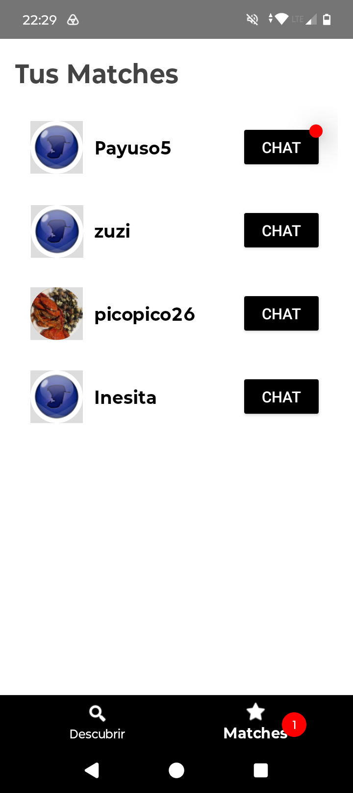
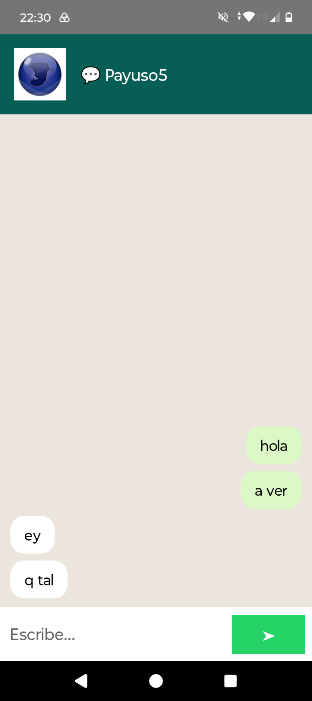
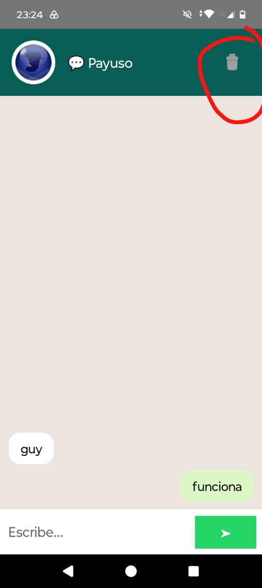
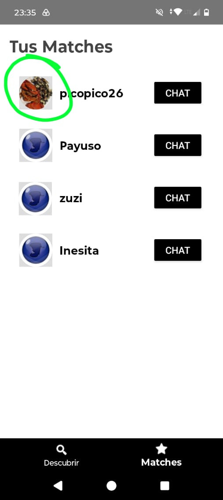
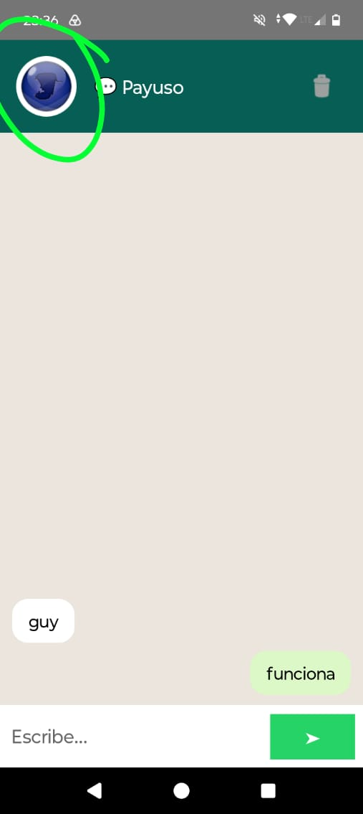

# MandiChat
Free chat for dating, with no email, phone, or censorship of freedom of expression.

First window you will see is for new profile creating.
Once saved the profile you will see the Discovery Window:

Here you will have to clic "Like" or "No" if you want to establish chat with the person proposed by the app. This window can be always accessed by clic "Descubrir" button.
You can also see all the user photos loaded by the user. A user with 1/1 "standard MandiChat photo" will appear when the no photo is uploaded by the user.

When you connect with another user that has given a Like to you, the message "Match creado" will appear on screen". You can the go to Matches to see what chat has been created for both of you. No one can see this conversation between you and the other user. All the chats are completely private. This is the window that will appear if you press Matches button on the bottom right part of the window:

If you want to modify your profle, upload any photo of yourself, or delete all the data you have introduced on this app,you will have to press the "pencil" button on the top left corner of Discovery window and you will be introduced to this window for profile editing:

To delete any photo just press on it and it will disappear.

You can also upload 4 photos to the database, or even Delete your profile from MandiChat if you press red button "Borrar cuenta permanentemente" on the bottom part of this window.

If you want to chat on any chat in Matches window, just press on the black "chat" box and this chat window will appear:

To exit chat just click backwards on your android mobile.

In the v1.1 of Mandichat, you can delete any profile you don't want to chat with, by pressing the Trash icon on the top right part of the chat, and all data related (likes, messages, match) will be deleted from database. You will have to click like on its user again on the discovery window, and the same the user with you, to maintain a new chat between both.

You can also press on any photo in the matches or chat window, and the profile of the user will appear, so that you can verify its profile data and photos.

  
   

##############################

Because this apk is from a third party, and is not included in Google Market Place, you will have to allow the installation. Some mobile devices display a drop-down menu; you tap the arrow and accept the installation anyway.

##############################

Download the first version of the app MandiChat here: [Download MandiChat.APK v1.0](https://github.com/elMandibulas/MandiChat/releases/download/v1.0/MandiChat_v1.0.apk)

Download the last version of the app MandiChat here: [Download MandiChat.APK v1.1](https://github.com/elMandibulas/MandiChat/releases/download/v1.1/MandiChat_v1.1.apk)

This second version contains chat deleting and profile watching from Matches or Chat windows, on any chat where you press the user photo.
